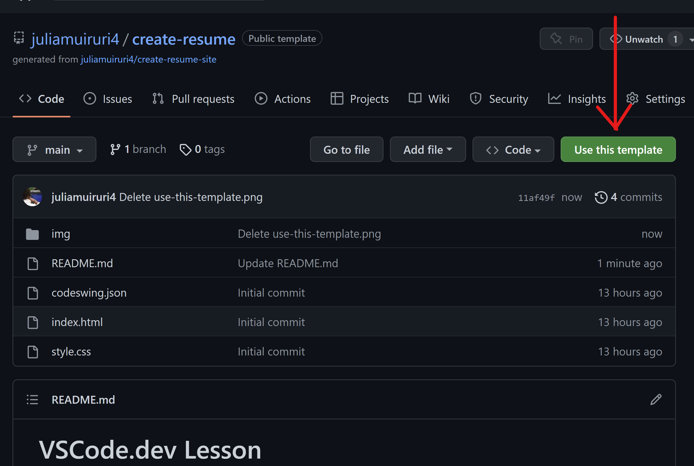

# VSCode.dev Lesson
## Edit & Update files on vscode.dev

## Steps
1. Click the green `Use Template Button` at the top of this repository. 
    That will create this repository in your GitHub Account with the same structure and files.

See [full workshop](https://github.com/microsoft/workshop-library/blob/main/full/build-resume-website/README.md/?WT.mc_id=academic-70942-juliamuiruri) to learn more
